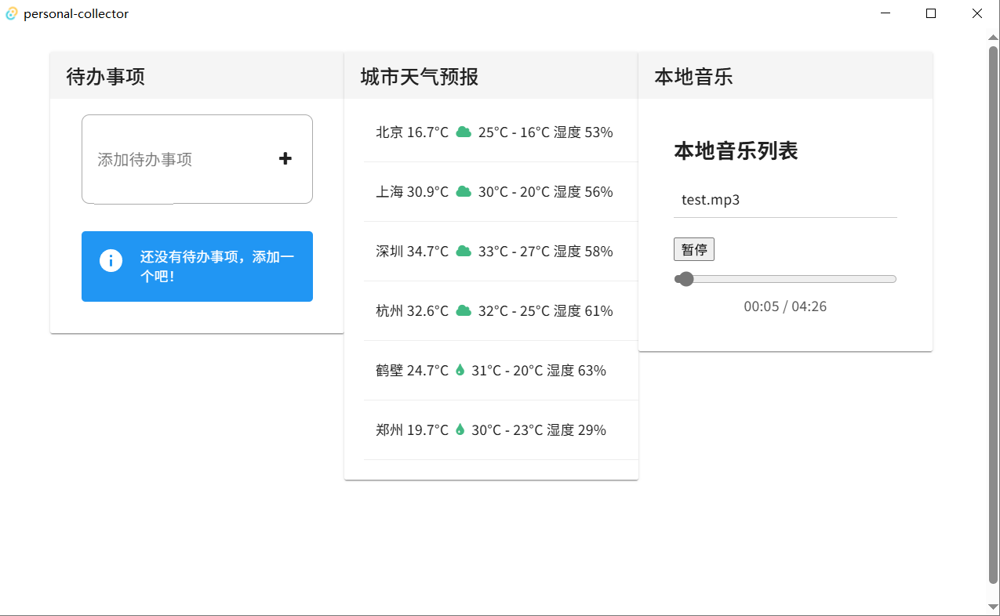

# 个人收集器 PERSONAL-COLLECTOR

> 基于 [Tauri](https://tauri.app/)、[Vue 3](https://vuejs.org/guide/introduction.html) 和 [TypeScript](https://www.typescriptlang.org/) 的桌面应用开发模板进行开发。

## 🚀 项目简介

该项目为使用 Vue 3（配合 `<script setup>` 语法）和 TypeScript 构建的桌面应用模板，结合 Tauri 提供本地化能力。适合需要轻量级、跨平台、前端技术栈驱动的桌面应用开发。

### 主要功能模块：
- ✅ 待办事项管理（增删改查）
- ☀️ 城市天气预报
- 🎵 本地音乐播放器

## 🛠 技术栈

| 技术 | 描述 |
|------|------|
| **Vue 3** | 使用 Composition API 和 `<script setup>` 语法 |
| **TypeScript** | 类型安全的 JavaScript 超集 |
| **Vite** | 快速冷启动的下一代前端构建工具 |
| **Tauri** | 轻量级替代 Electron 的桌面应用框架 |
| **Rust** | 后端逻辑与数据库交互（SQLite） |
| **Vuetify** | Material Design 风格组件库 |

## 💡 推荐 IDE 设置

- [VS Code](https://code.visualstudio.com/)
  - [Volar](https://marketplace.visualstudio.com/items?itemName=Vue.volar)（Vue 开发支持）
  - [Tauri](https://marketplace.visualstudio.com/items?itemName=tauri-apps.tauri-vscode)
  - [rust-analyzer](https://marketplace.visualstudio.com/items?itemName=rust-lang.rust-analyzer)

### 启用 Volar Take Over 模式（提升 [.vue](file://d:\Documents\personal-collector\src\App.vue) 类型支持）

1. 打开命令面板：`Extensions: Show Built-in Extensions`
2. 禁用 `TypeScript and JavaScript Language Features`
3. 重新加载 VS Code：`Developer: Reload Window`

了解更多：[Volar Take Over Mode](https://github.com/johnsoncodehk/volar/discussions/471)

## 🧪 快速开始

```bash
# 安装依赖
pnpm install

# 启动开发
pnpm tauri dev
```

## 📷 效果图

